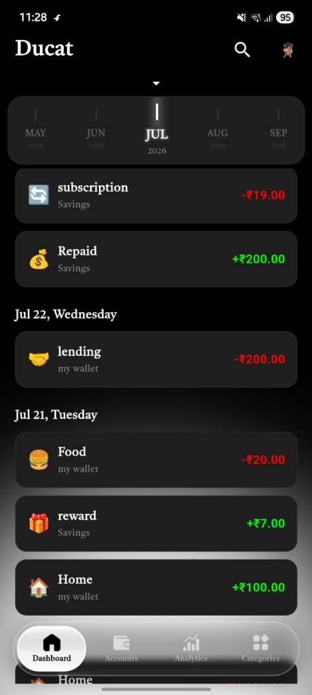
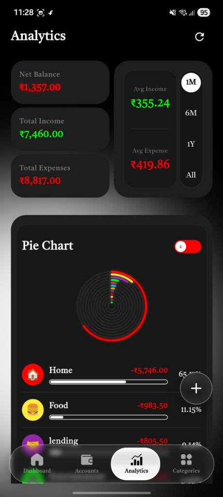

# 💰 My Money — Personal Finance Tracker

A sleek, dark-themed personal finance app built with **Flutter** and powered by **Firebase**. Track expenses, incomes, and transfers across multiple accounts with beautiful analytics and full offline support.

---

## 📱 App Screenshots

| 📊 Dashboard | 📈 Analytics |
| :---: | :---: |
|  |  |

---

## ✨ Features

- **📊 Dashboard** — Overview of total balance, recent transactions, and quick-add controls
- **📈 Analytics** — Pie charts, trend graphs, and category-wise spending breakdowns
- **🏦 Accounts** — Manage multiple accounts with real-time balance tracking and fund transfers
- **🗂️ Categories** — Create custom emoji-based expense & income categories
- **👤 Profile** — Manage your profile, select currency, export data as CSV, and sign out
- **🔐 Authentication** — Google Sign-In and Email/Password login via Firebase Auth
- **🌐 Offline Support** — Local data persistence with `shared_preferences` and `path_provider`
- **📤 CSV Export** — Export all transactions to a CSV file and share them directly
- **🎨 Dark UI** — Premium dark theme with glassmorphism effects and smooth animations

---

## 🛠️ Tech Stack

| Layer | Technology |
|---|---|
| Framework | Flutter (Dart SDK `^3.12.2`) |
| State Management | Provider `^6.1.5` |
| Backend / Auth | Firebase Auth + Cloud Firestore |
| Local Storage | Shared Preferences |
| Charts | fl_chart `^1.2.0` |
| Fonts | Google Fonts |
| File Handling | file_picker, path_provider, share_plus |
| Internationalization | intl `^0.20.3` |
| Connectivity | connectivity_plus |

---

## 📁 Project Structure

```
lib/
├── main.dart               # App entry point
├── core/                   # Theme, typography, currency formatting
├── models/                 # Data models (Account, Transaction, Category, Currency)
├── providers/              # AppProvider — central state management
├── services/               # Local store (shared_preferences persistence)
└── ui/
    ├── components/         # Reusable widgets (buttons, charts, dialogs, backgrounds)
    └── screens/
        ├── login_screen.dart
        ├── onboarding_screen.dart
        ├── app_navigator.dart       # Bottom nav shell
        ├── dashboard_screen.dart
        ├── analytics_screen.dart
        ├── accounts_screen.dart
        ├── categories_screen.dart
        └── profile_screen.dart
```

---

## 🚀 Getting Started

### Prerequisites

- [Flutter SDK](https://docs.flutter.dev/get-started/install) `>=3.12.2`
- A Firebase project with **Authentication** and **Firestore** enabled
- Android Studio / VS Code with Flutter & Dart plugins

### 1. Clone the repository

```bash
git clone https://github.com/your-username/my_money_flutter.git
cd my_money_flutter
```

### 2. Firebase Setup

1. Create a Firebase project at [console.firebase.google.com](https://console.firebase.google.com)
2. Enable **Email/Password** and **Google** sign-in methods under Authentication
3. Create a **Cloud Firestore** database
4. Download `google-services.json` (Android) and place it in `android/app/`
5. Download `GoogleService-Info.plist` (iOS) and place it in `ios/Runner/`

### 3. Install dependencies

```bash
flutter pub get
```

### 4. Run the app

```bash
flutter run
```

---

## 📱 Supported Platforms

| Platform | Status |
|---|---|
| Android | ✅ Supported |
| iOS | ✅ Supported |
| Web | 🔧 Partial |
| Windows | 🔧 Partial |
| macOS / Linux | 🔧 Partial |

---

## 🗃️ Data Models

| Model | Fields |
|---|---|
| `Account` | id, name, balance, createdAt, position |
| `TransactionModel` | id, amount, type (`expense`/`income`/`transfer`), categoryId, accountId, toAccountId, note, date |
| `CategoryModel` | id, name, icon (emoji), type (`expense`/`income`) |
| `CurrencyModel` | code, symbol, name |
| `AppUser` | uid, email, name, photoPath |

---

## 📤 CSV Export

Navigate to **Profile → Export Data** to download all your transactions as a `.csv` file, which can be opened in Excel, Google Sheets, or any spreadsheet app.

---

## 🔒 Security

- User data is stored per-UID in Firestore — each user only accesses their own documents
- Firestore Security Rules should be configured to enforce `request.auth.uid == userId`
- No sensitive keys are hardcoded in the source code

---

## 🤝 Contributing

1. Fork the repository
2. Create a feature branch: `git checkout -b feature/your-feature`
3. Commit your changes: `git commit -m 'Add your feature'`
4. Push to the branch: `git push origin feature/your-feature`
5. Open a Pull Request

---

## 📄 License

This project is for personal use. Feel free to fork and adapt it for your own needs.
